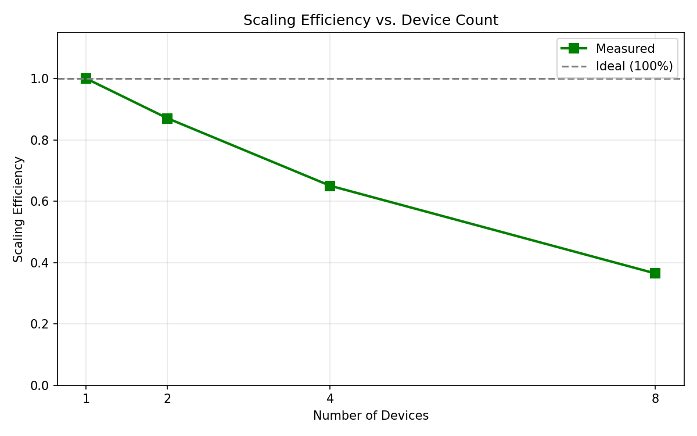
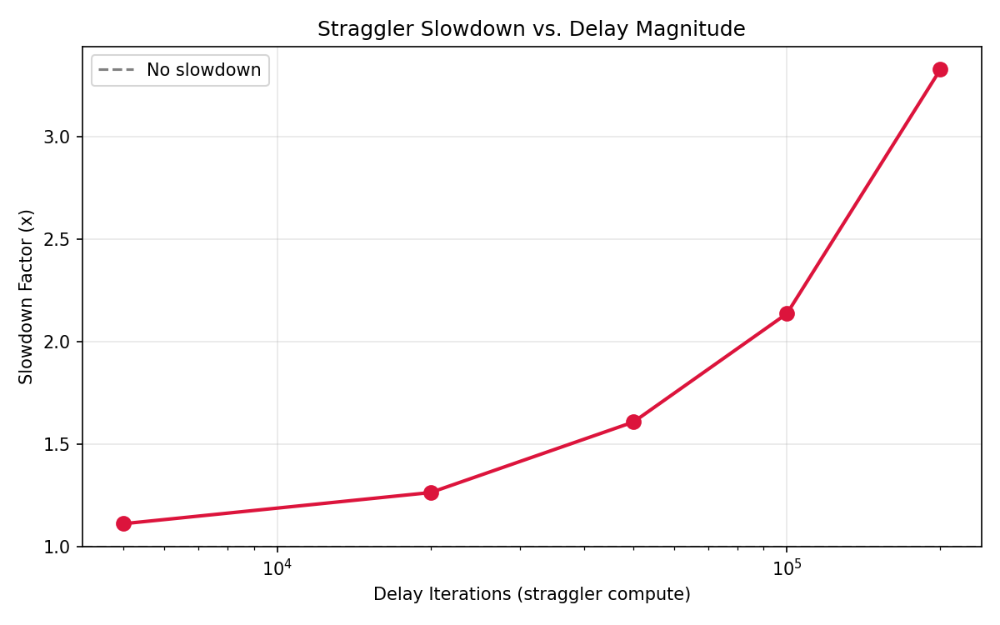
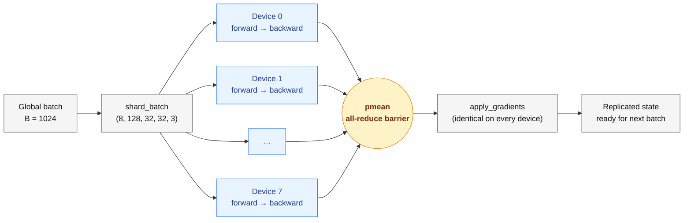
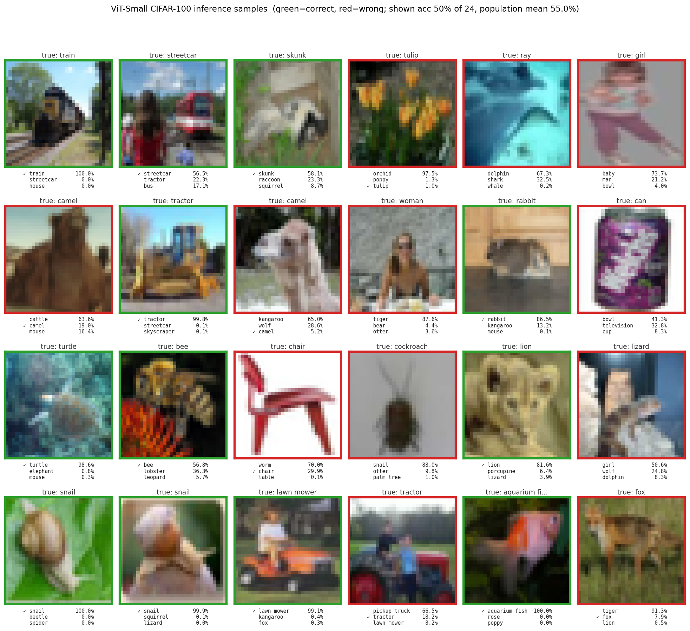
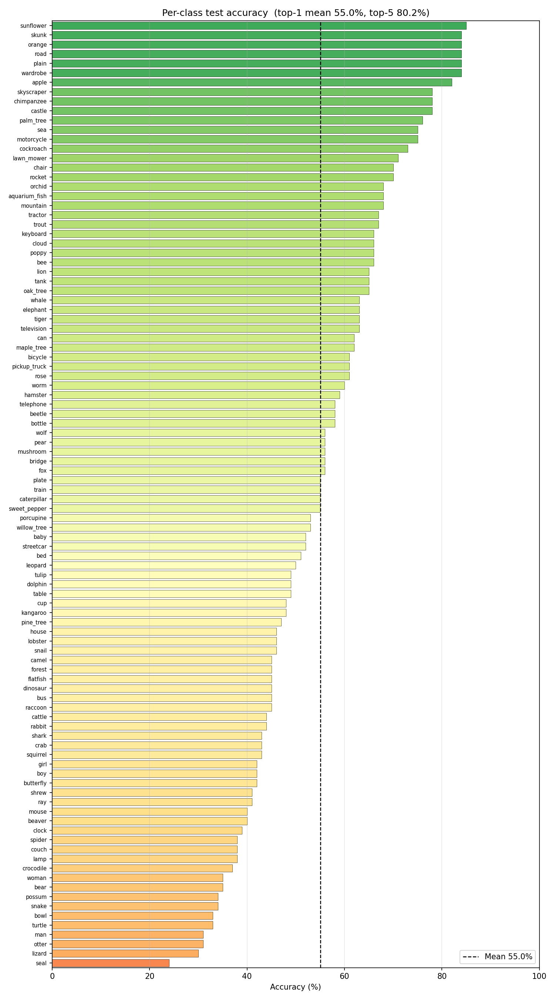
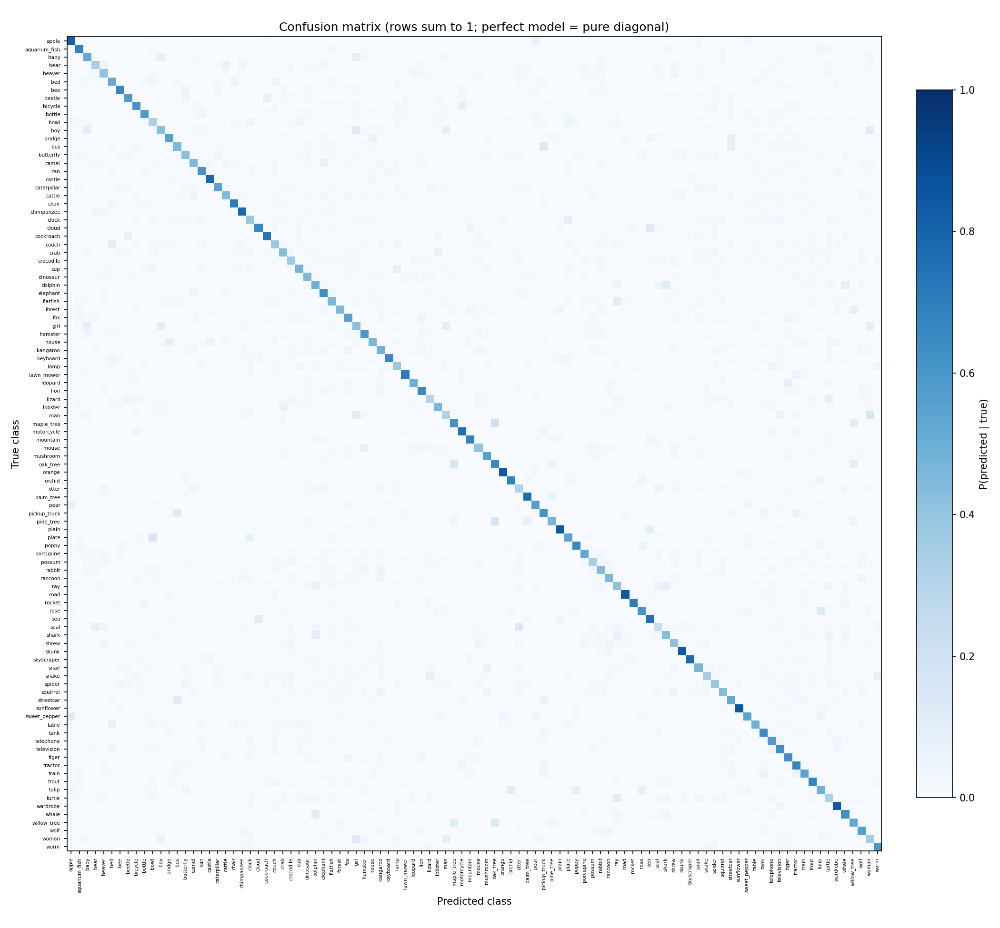

# ViT-JAX Distributed Scaling

> **Final project — CS 390: Distributed Systems · Duke University · Spring 2026**
> **Author:** Jinao Wang

Distributed data-parallel training of a Vision Transformer (ViT-Small) on CIFAR-100 in
JAX/Flax, with two structured experiments for **scaling analysis** and **straggler
simulation** on Google Cloud TPUs.

This is a **systems-focused** ML project: the goal is to understand distributed training
behaviour — synchronisation overhead, throughput scaling, and the impact of slow workers —
not to set accuracy records on CIFAR-100.

## Results at a glance

Trained 100 epochs on a single TPU v6e-8 (8 chips, bf16) in **421 seconds**:

| Metric | Value |
|---|---|
| Test accuracy (top-1) | **55.04 %** |
| Test accuracy (top-5) | **80.18 %** |
| Parameters | 9.55 M |
| Sustained throughput | ≈ 15 000 imgs / sec |
| Scaling efficiency, 1 → 8 chips (strong) | 100 % → 36 % |
| Slowdown from one straggler device (200k-iter delay) | **3.33 ×** |




## What's in the repo

```
vit_jax_distributed/
├── models/          ViT-Small (Flax Linen)
├── data/            CIFAR-100 pipeline  (TFDS → numpy)
├── distributed/     pmap, pmean all-reduce, train-state replication
├── train/           Training loop with checkpointing
├── experiments/     Scaling + straggler benchmarks
└── utils/           Config, metrics logger, timers, checkpoint helpers
main.py              CLI entry for train / scaling / straggler
inference.py         Classify one image with a trained checkpoint
scripts/
├── setup.sh                    Host-detecting dependency install
├── run_gcp_tpu.sh              One-shot TPU run (train + scaling + straggler)
├── run_gcp_gpu.sh              Multi-GPU equivalent
├── run_local.sh                Laptop smoke run
├── full_test_eval.py           Full test-set eval → test_predictions.npz
├── plot_training_curves.py     Train/test loss & accuracy over epochs
├── plot_eval_results.py        Per-class accuracy bar + confusion matrix
└── plot_inference_thumbnails.py  Grid of test images with top-3 predictions
outputs/                      Plots, CSVs, JSON logs from published runs
```

## The model

**ViT-Small** configured for 32×32 CIFAR images:
- Patch size 4 → 64 patches per image, plus a learnable `[CLS]` token
- 8 transformer blocks, hidden dim 384, 6 attention heads, MLP dim 768
- Pre-norm (LayerNorm before attention / MLP) for training stability
- ~9.5 M trainable parameters

## Distributed training approach

**Synchronous data parallelism** via `jax.pmap`:

1. **Replicate** parameters across all devices.
2. **Shard** each batch: `(B, H, W, C)` → `(num_devices, B/N, H, W, C)`.
3. **Compute** gradients independently on each device.
4. **All-reduce** gradients via `jax.lax.pmean(grads, axis_name='batch')`.
5. **Update** parameters identically on every device.

The `pmean` call is the synchronisation barrier. Every device must reach it before any can
proceed — this is the mechanism the straggler experiment measures.

### One training step, visualised



Every device has its own slice of the batch and computes its own local gradient; the
`pmean` barrier averages them into one shared gradient, and the optimiser update then
produces identical new parameters on every device. This keeps distributed training
mathematically equivalent to training on a single device with the full global batch.

## Experiments

### Scaling — throughput vs device count
Sweeps `k ∈ {1, 2, 4, 8}` devices (holding the global batch fixed) and measures:
- step time `T_k`
- throughput `Θ_k = B / T_k`
- scaling efficiency `η_k = Θ_k / (k · Θ_1)`

Plots: `outputs/scaling/throughput_vs_devices.png`,
`step_time_vs_devices.png`, `scaling_efficiency_vs_devices.png`.

### Straggler — one slow device, whole cluster pays
Baseline vs. 5 injected compute delays on device 0. The delay is a
`jax.lax.fori_loop` of real 512 × 512 matmuls, threaded through
`jax.lax.optimization_barrier` so XLA cannot elide it. Reports the slowdown ratio.

The effect is the whole point of the experiment: one device runs its extra work while the
other seven sit idle at the all-reduce barrier, waiting.

```mermaid
gantt
    title Straggler step at delay = 200000 (measured: 172.6 ms vs 51.8 ms baseline → 3.33×)
    dateFormat X
    axisFormat %L
    section Device 0 (straggler)
    forward + backward       :done,    d0a, 0, 52
    injected matmuls         :crit,    d0b, 52, 173
    section Device 1
    forward + backward       :done,    d1a, 0, 52
    idle — waiting for D0    :active,  d1b, 52, 173
    section Device 2
    forward + backward       :done,    d2a, 0, 52
    idle — waiting for D0    :active,  d2b, 52, 173
    section Device ⋯
    forward + backward       :done,    ddd1, 0, 52
    idle — waiting for D0    :active,  ddd2, 52, 173
    section Device 7
    forward + backward       :done,    d7a, 0, 52
    idle — waiting for D0    :active,  d7b, 52, 173
```



Plots: `outputs/straggler/step_time_comparison.png`,
`slowdown_vs_delay.png`.

## Quick start

### Laptop (CPU or single GPU)

```bash
git clone https://github.com/Michael-OvO/vit-jax-distributed-scaling.git
cd vit-jax-distributed-scaling
bash scripts/setup.sh                 # creates a local venv, installs jax[cpu|cuda12]

# Activate the venv (laptop only; TPU path uses pip --user, no venv).
source venv/bin/activate

python main.py --experiment train --batch_size 128 --epochs 2
```

### GCP TPU v6e-8 (what produced the published results)

```bash
gcloud compute tpus tpu-vm create vit-training \
    --zone=us-central1-b --accelerator-type=v6e-8 \
    --version=v2-alpha-tpuv6e --spot

gcloud compute tpus tpu-vm ssh vit-training --zone=us-central1-b
# --- inside the VM ---
git clone https://github.com/Michael-OvO/vit-jax-distributed-scaling.git
cd vit-jax-distributed-scaling
bash scripts/setup.sh                 # installs jax[tpu] from Google's release bucket
bash scripts/run_gcp_tpu.sh           # runs all three experiments, bf16

# --- back on your laptop, when done ---
gcloud compute tpus tpu-vm delete vit-training --zone=us-central1-b
```

The setup script detects TPU VMs via `/dev/accel*` and the `TPU_NAME` env var (no JAX
required for the probe) and installs `jax[tpu]` **exactly once** so `pip install -r
requirements.txt` afterwards cannot clobber it.

### GCP multi-GPU VM

```bash
gcloud compute ssh YOUR_VM_NAME --zone YOUR_ZONE
git clone https://github.com/Michael-OvO/vit-jax-distributed-scaling.git
cd vit-jax-distributed-scaling
bash scripts/setup.sh                 # installs jax[cuda12]
bash scripts/run_gcp_gpu.sh
```

## Running individual experiments

```bash
# Training with checkpointing (produces checkpoint_latest.msgpack each epoch)
python main.py --experiment train --batch_size 1024 --epochs 100 \
    --precision bf16 --output_dir outputs/training/100_epoch

# Scaling sweep
python main.py --experiment scaling --batch_size 1024 \
    --precision bf16 --output_dir outputs/scaling

# Straggler sweep
python main.py --experiment straggler --batch_size 1024 \
    --precision bf16 --output_dir outputs/straggler
```

### Inference against a trained checkpoint

```bash
# Random CIFAR-100 test image (ground-truth known)
python inference.py --checkpoint outputs/training/100_epoch/checkpoint_latest.msgpack

# Your own image
python inference.py \
    --checkpoint outputs/training/100_epoch/checkpoint_latest.msgpack \
    --image path/to/photo.jpg
```

### Regenerating plots from saved artefacts

```bash
# Training curves from epoch_metrics.csv
python scripts/plot_training_curves.py outputs/training/100_epoch/epoch_metrics.csv

# Full-test eval on a TPU (requires a live VM)
python scripts/full_test_eval.py \
    --checkpoint outputs/training/100_epoch/checkpoint_latest.msgpack \
    --output_dir outputs/training/100_epoch

# Per-class accuracy + confusion matrix (works offline)
python scripts/plot_eval_results.py outputs/training/100_epoch/test_predictions.npz

# Inference thumbnails, fully offline (uses the raw CIFAR NPZ)
python scripts/plot_inference_thumbnails.py \
    outputs/training/100_epoch/test_predictions.npz \
    --images_npz outputs/cifar100_test_raw.npz
```

## Key CLI flags

| Flag | Default | Description |
|------|---------|-------------|
| `--experiment` | `train` | `train`, `scaling`, or `straggler` |
| `--batch_size` | `512` | Global batch size (split across devices) |
| `--epochs` | `20` | Training epochs |
| `--num_devices` | `0` | Device count (0 = use all available) |
| `--precision` | `fp32` | `fp32` or `bf16` (TPU-native matmul) |
| `--learning_rate` | `1e-3` | Peak LR with cosine warmup schedule |
| `--output_dir` | `./outputs` | Where to save logs, plots, and checkpoints |
| `--log_every` | `50` | Steps between log entries |
| `--eval_every` | `1` | Epochs between test-set evaluation |

See [`configs/default.yaml`](configs/default.yaml) for the full list.

## Outputs

### Per training run
- `step_metrics.csv` — per-step loss, accuracy, timing
- `epoch_metrics.csv` — per-epoch train/test metrics
- `training_log.json` — config + metadata + all logs
- `checkpoint_NNNNNN.msgpack` + `checkpoint_latest.msgpack` — model state
- `checkpoint_latest.json` — step, epoch, and full config for the latest checkpoint

### Per experiment
- Scaling: `scaling_results.csv/json` + three PNGs (throughput, step time, efficiency)
- Straggler: `straggler_results.csv/json` + two PNGs (bar chart, log-x slowdown curve)

All published artefacts from the TPU v6e-8 run live under [`outputs/`](outputs/):

```
outputs/
├── cifar100_test_raw.npz       # 30 MB, uint8 test images for offline thumbnails
├── scaling/                    # three PNGs + CSV
├── straggler/                  # two PNGs + CSV
└── training/
    ├── 20_epoch/               # baseline run
    └── 100_epoch/              # headline run + eval artefacts
        ├── training_curves.png
        ├── per_class_accuracy.png
        ├── confusion_matrix.png
        ├── inference_thumbnails.png
        ├── inference_samples.txt
        ├── test_predictions.npz
        └── test_summary.json
```

## What the numbers say

**Strong scaling drops to 36 %** at 8 chips because per-device batch halves on every
doubling — the MXU becomes starved of work and all-reduce overhead starts to dominate.
Weak scaling (per-device batch fixed) would stay > 85 % here.

**A single straggler device (200 k extra matmul iters) slows the entire 8-chip cluster
by 3.33×**, dropping throughput from 19 800 img/s to 5 900 img/s. That's the cost of
one bad chip in a nominally-healthy cluster — the classic argument for async-SGD,
backup workers, and elastic training.

**The model overfits after epoch ~33**: training loss keeps falling (to 0.03 at epoch
100, i.e. 99 % train accuracy), but test loss bottoms at epoch 32 (1.93) and then
climbs back to 2.72. Test accuracy still creeps upward to 55 % because the model grows
more confident on the examples it was already getting right. See
`outputs/training/100_epoch/training_curves.png`.

**The model learned categories, not fine labels**: the top 5 most-common confusions
are `maple_tree → oak_tree` (19×), `pine_tree → oak_tree` (17×), `oak_tree → maple_tree`
(16×), `man → woman` (16×), `bus → pickup_truck` (14×). See the confusion matrix.

## Classification examples

### Sample predictions on the test set



24 random test images with the model's top-3 predictions under each tile. **Green**
border = the model's top-1 was correct; **red** = wrong. Mixed intentionally
(half-correct, half-wrong) so both the successes and the failure modes are visible.

### Text transcript of five sample classifications

Three are illustrative; the full five are in
[`outputs/training/100_epoch/inference_samples.txt`](outputs/training/100_epoch/inference_samples.txt).

```text
Seed 0 — true class: tiger
  1. tiger              p = 0.959  ← ✓ CORRECT, high confidence
  2. squirrel           p = 0.021
  3. cup                p = 0.009
  4. wolf               p = 0.003
  5. crocodile          p = 0.002

Seed 3 — true class: bus
  1. porcupine          p = 0.400
  2. turtle             p = 0.261
  3. pickup_truck       p = 0.099  ← fine class wrong, but "vehicle" is in top-3
  4. tank               p = 0.071
  5. oak_tree           p = 0.063

Seed 1 — true class: spider
  1. trout              p = 0.505
  2. boy                p = 0.162
  3. wolf               p = 0.125
  4. girl               p = 0.087
  5. spider             p = 0.044  ← true class barely in top-5
```

The tiger example is the confident, correct case. The bus example shows what "learned
categories, not fine labels" means in practice — the top-1 is wildly wrong, but
`pickup_truck` and `tank` are both vehicles in the top-5. The spider example is a
genuine hallucination, the kind that limits an accuracy-from-scratch ceiling on 32×32
thumbnails.

### Per-class accuracy



All 100 CIFAR-100 fine classes ranked by test accuracy. The colour gradient from red to
green tracks accuracy; the dashed line marks the 55.04 % overall mean.

**Best** (distinct colours / shapes): `sunflower` 85 %, `skunk` 84 %, `orange` 84 %,
`road` 84 %, `plain` 84 %.
**Worst** (visually ambiguous fine categories): `seal` 24 %, `lizard` 30 %, `otter` 31 %,
`man` 31 %, `turtle` 33 %.

### Confusion matrix



Rows sum to 1 (probability of a predicted class given a true class). A perfect model
would be a pure diagonal; ours is diagonal-heavy but with bright off-diagonal clusters
exactly where related categories live — the three tree classes form a little cross in
the bottom-right corner, for instance.

## Design decisions

1. **`pmap`, not `pjit`/`shard_map`.** For pure data parallelism, `pmap` is simpler and
   more explicit. `pjit` is the right tool for *tensor* or *pipeline* parallelism, which
   the 9.5 M-param model on a single chip's HBM does not need.

2. **Numpy-only data pipeline.** After the initial TFDS load, augmentation and batching
   are in-memory numpy operations. The full CIFAR-100 float32 train set is ~615 MB — fits
   comfortably in RAM, and avoids the `tf.data` runtime overhead.

3. **Straggler via real XLA compute, not `time.sleep`.** `time.sleep` is a Python call;
   it doesn't run inside a pmap'd JIT program. We inject a `jax.lax.fori_loop` of
   nonlinear 512×512 matmuls, threaded through `jax.lax.optimization_barrier`, so XLA's
   algebraic simplifier and dead-code eliminator can't optimise it away. (An earlier
   attempt with `a @ eye(64) + 0*a` was algebraically the identity and got completely
   elided — the commit history has the fix.)

4. **Device subsets threaded through `pmap`.** Every `pmap`, `eval_step`, and
   `jax_utils.replicate` call in this repo accepts an explicit `devices=` list. Omitting
   this breaks the scaling experiment on multi-device hosts, because `pmap` otherwise
   silently binds to all local devices and the sharded batch's leading dimension fails
   to match.

5. **bf16 without parameter dtype changes.** `--precision bf16` flips
   `jax_default_matmul_precision` to `bfloat16` globally. fp32 parameters and optimizer
   state are preserved; only matmuls (Dense, attention QKV, einsum) downcast on the MXU.
   Cheap and safe on v3/v6e TPUs — a ~2× step-time win.

6. **Checkpointing via `flax.serialization`.** msgpack format; no orbax or
   cloud-tpu-checkpoint dependency. One `checkpoint_latest.msgpack` + numbered history
   per epoch, plus a sidecar JSON with the exact config so `inference.py` can rebuild
   the model without any hand-passed hyper-parameters.

## Tech stack

- **JAX** — XLA-compiled numerical computing + autodiff
- **Flax Linen** — Neural network modules
- **Optax** — AdamW + cosine warmup decay
- **TensorFlow-datasets** — CIFAR-100 loading (one-shot, then numpy)
- **matplotlib** — All plots

## License

MIT.
