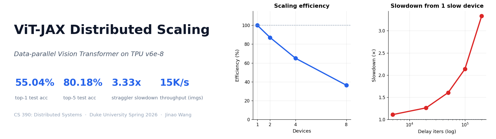
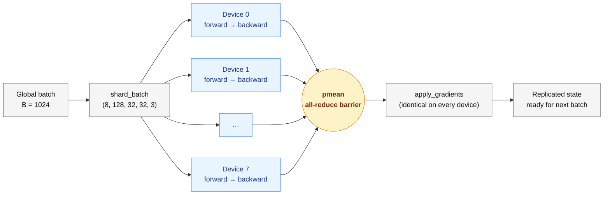

<p align="center">
  
</p>

# ViT-JAX Distributed Scaling

*Jinao Wang · CS 390 (Distributed Systems), Duke University · Spring 2026*

Distributed data-parallel training of a Vision Transformer (ViT-Small) on CIFAR-100 in
JAX/Flax, with two experiments for scaling analysis and straggler simulation on Google
Cloud TPUs. A systems-focused study: the goal is to understand how distributed training
actually behaves (sync overhead, throughput scaling, what a slow worker costs), not to
push accuracy on CIFAR-100.

Full write-up: [2-page report](report/final_report.pdf) · [30-minute extended deck](slides/30min_backup_deck.pdf).

## Results at a glance

Trained 100 epochs on a single TPU v6e-8 (8 chips, bf16) in **421 seconds**:

| Metric | Value |
|---|---|
| Test accuracy (top-1 / top-5) | **55.04 %** / **80.18 %** |
| Parameters | 9.55 M |
| Sustained throughput | ≈ 15 000 imgs / sec |
| Strong-scaling efficiency, 1 → 8 chips | 100 % → 36 % |
| Slowdown from one straggler (200 k-iter delay) | **3.33 ×** |


## What's in the repo

```
vit_jax_distributed/
├── models/          ViT-Small (Flax Linen)
├── data/            CIFAR-100 pipeline (TFDS → numpy)
├── distributed/     pmap, pmean all-reduce, train-state replication
├── train/           Training loop with checkpointing
├── experiments/     Scaling + straggler benchmarks
└── utils/           Config, metrics logger, timers, checkpoint helpers
main.py              CLI for train / scaling / straggler
inference.py         Classify one image with a trained checkpoint
scripts/             setup.sh, run_gcp_tpu.sh, plotting helpers
outputs/             Plots, CSVs, JSON logs from the published run
report/              2-page formal write-up (.tex + .pdf)
slides/              5-min presentation + 30-min extended deck (.tex + .pdf)
```

## The model

ViT-Small for 32×32 CIFAR images: patch size 4 (64 patches per image + a `[CLS]` token),
8 transformer blocks, hidden dim 384, 6 heads, MLP dim 768, pre-norm, ~9.5 M parameters.

## Distributed training approach

Synchronous data parallelism via `jax.pmap`: replicate parameters, shard the batch,
compute gradients independently per device, all-reduce with `jax.lax.pmean`, apply an
identical update on every device. The `pmean` is the synchronisation barrier — every
device has to reach it before any can proceed, which is exactly the mechanism the
straggler experiment probes.



Net effect: distributed training is mathematically equivalent to training on a single
device with the full global batch.

## Experiments

**Scaling.** Sweeps `k ∈ {1, 2, 4, 8}` devices at fixed global batch 1024, measuring step
time `T_k`, throughput `Θ_k = B / T_k`, and strong-scaling efficiency `η_k = Θ_k / (k · Θ_1)`.

**Straggler.** Baseline plus 5 injected compute delays on device 0. The delay is a
`jax.lax.fori_loop` of nonlinear 512 × 512 matmuls, threaded through
`jax.lax.optimization_barrier` so XLA can't elide it. Reports the slowdown ratio — the
other seven devices sit idle at the all-reduce barrier while device 0 does the extra work.

## Quick start

### GCP TPU v6e-8 (what produced the published results)

```bash
gcloud compute tpus tpu-vm create vit-training \
    --zone=us-central1-b --accelerator-type=v6e-8 \
    --version=v2-alpha-tpuv6e --spot
gcloud compute tpus tpu-vm ssh vit-training --zone=us-central1-b

# --- inside the VM ---
git clone https://github.com/Michael-OvO/vit-jax-distributed-scaling.git
cd vit-jax-distributed-scaling
bash scripts/setup.sh                 # installs jax[tpu] once, then requirements
bash scripts/run_gcp_tpu.sh           # runs train + scaling + straggler, bf16

# --- back on your laptop ---
gcloud compute tpus tpu-vm delete vit-training --zone=us-central1-b
```

The setup script detects TPU VMs via `/dev/accel*` and `TPU_NAME` (no JAX needed for the
probe) and installs `jax[tpu]` before `requirements.txt` can clobber it with a CPU wheel.

### Laptop smoke test

```bash
git clone https://github.com/Michael-OvO/vit-jax-distributed-scaling.git
cd vit-jax-distributed-scaling
bash scripts/setup.sh                 # creates venv, installs jax[cpu|cuda12]
source venv/bin/activate
python main.py --experiment train --batch_size 128 --epochs 2
```

A multi-GPU variant (`scripts/run_gcp_gpu.sh`) is included and works identically with
`jax[cuda12]`.

## Running individual experiments

```bash
# Training
python main.py --experiment train --batch_size 1024 --epochs 100 \
    --precision bf16 --output_dir outputs/training/100_epoch

# Scaling / straggler sweeps
python main.py --experiment scaling   --batch_size 1024 --precision bf16
python main.py --experiment straggler --batch_size 1024 --precision bf16
```

Inference against a checkpoint: `python inference.py --checkpoint <path>` (optionally
`--image path/to/photo.jpg`). Plotting helpers live in `scripts/` and regenerate every
figure offline from the saved CSVs/NPZs.

## Key CLI flags

| Flag | Default | Description |
|------|---------|-------------|
| `--experiment` | `train` | `train`, `scaling`, or `straggler` |
| `--batch_size` | `512` | Global batch size (split across devices) |
| `--epochs` | `20` | Training epochs |
| `--num_devices` | `0` | Device count (0 = use all available) |
| `--precision` | `fp32` | `fp32` or `bf16` (TPU-native matmul) |
| `--learning_rate` | `1e-3` | Peak LR with cosine warmup schedule |
| `--output_dir` | `./outputs` | Where to save logs, plots, and checkpoints |

See [`configs/default.yaml`](configs/default.yaml) for the full list.

## What the numbers say

Strong scaling drops to 36 % at 8 chips because per-device batch halves on every
doubling — the MXU gets starved and the all-reduce dominates. Weak scaling would stay
above 85 %. A single straggler device at 200 k iterations slows the whole cluster by
3.33× (19 800 → 5 900 img/s) — the textbook argument for async SGD, backup workers, and
elastic training. The model overfits after epoch ~33 (test loss bottoms at 1.93, climbs
back to 2.72) and confuses related categories rather than random ones: the top confusions
are `maple_tree ↔ oak_tree`, `pine_tree → oak_tree`, `man → woman`, `bus → pickup_truck`.
It learned categories, not fine labels.

## Classification examples


24 random test images with the model's top-3 predictions under each tile. Green borders
mark correct top-1 predictions, red marks wrong ones; mixed roughly half-and-half on
purpose. Per-class accuracy and the full confusion matrix are in
[`outputs/training/100_epoch/`](outputs/training/100_epoch/), and five text-format
examples are in [`inference_samples.txt`](outputs/training/100_epoch/inference_samples.txt).

## Design decisions

1. **`pmap`, not `pjit`/`shard_map`.** Pure data parallelism is simpler and more explicit
   under `pmap`. A 9.5 M-param model fits in a single chip's HBM, so tensor/pipeline
   parallelism isn't needed.

2. **Numpy-only data pipeline.** The full float32 train set is ~615 MB and lives in RAM
   after one TFDS load, so augmentation and batching sidestep `tf.data`'s runtime overhead.

3. **Straggler via real XLA compute, not `time.sleep`.** The delay is a
   `jax.lax.fori_loop` of nonlinear 512×512 matmuls, threaded through
   `jax.lax.optimization_barrier` so XLA's algebraic simplifier and DCE can't elide it.
   An earlier attempt with `a @ eye(64) + 0*a` folded to the identity and silently
   zeroed the effect; the commit history has the fix.

4. **Device subsets threaded through `pmap`.** Every `pmap`, `eval_step`, and
   `jax_utils.replicate` call takes an explicit `devices=` list. Skip it and `pmap`
   silently binds to all local devices, so the sharded leading dim stops matching.

5. **bf16 without parameter dtype changes.** `--precision bf16` flips
   `jax_default_matmul_precision` globally; parameters and optimiser state stay fp32.
   Matmuls downcast on the MXU — cheap, safe on v3/v6e, ~2× step-time win.

6. **Checkpointing via `flax.serialization`.** msgpack format, no orbax or
   cloud-tpu-checkpoint dependency. One `checkpoint_latest.msgpack` + numbered history
   per epoch, with a sidecar JSON holding the exact config so `inference.py` can rebuild
   the model without hand-passed hyperparameters.

## Tech stack

JAX (XLA-compiled numerics + autodiff), Flax Linen (modules), Optax (AdamW + cosine
warmup decay), tensorflow-datasets (one-shot CIFAR-100 load), matplotlib (plots).

## License

MIT.
